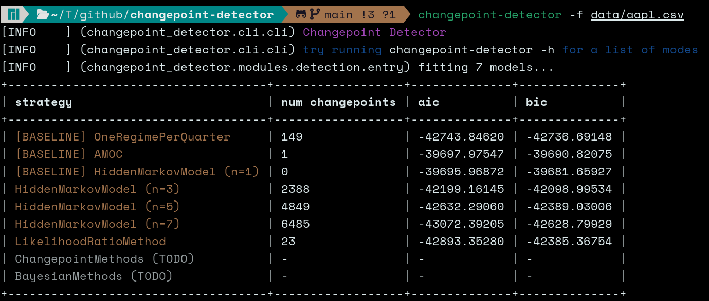

# <div align="center" style="font-weight: 400; background: darkslateblue; padding: 1rem; border-radius: 1rem">`changepoint-detector` 🔎 📉</div>

This tool is inspired by the paper
[Exploring Breaks in the Distribution of Stock Returns: Empirical Evidence from Apple Inc.](https://ssrn.com/abstract=370041)[^1]
Full credit for the methods used goes to the authors of the paper.

This tool also makes use of several changepoint libraries:
- [`changepoint-cython`](https://github.com/brunedv/changepoint_cython)
- [`hmmlearn`](https://hmmlearn.readthedocs.io/en/latest/)

**❗ IMPORTANT:** This tool is for educational purposes
and to benchmark various changepoint detection methods
explored in the paper above.
It should not be relied upon for anything important! 😃

## 📊 Changepoints

The **changepoints** of a time series $`\{Y_t\}\_{1:T}`$
form a partition $`\rho_{1:T}`$ of the set $\{1, \dots, T\}$
such that certain statistical properties are the same
within a sub-sequence and different between sub-sequences.

> This tool focuses on mean and variance of log returns,
> but any statistic can be examined.

The problem is essentially an $O(2^{T-1})$ search problem
in partition space.

## 📄 Overview of methods

### Evaluation criteria

The paper penalizes the training and evaluates performance
across model classes with Akaike Information Criterion (AIC),
Hannan–Quinn Information Criterion (HQIC), and Bayesian Information Criterion (BIC).
This tool emits BIC and AIC metrics.

### Detection methods

In addition to the 4 classes of methods described in the paper,
several baselines are considered.
The primary types of changepoint detection methods from the paper are as follow.

#### 1. Hidden Markov Models

Hidden Markov Models (HMMs) is implemented using `hmmlearn`.
The paper evaluates the performance of $N = 1, \dots, 8$ hidden states.
Similarly, this tool compares several numbers of hidden states,
with $N = 1$ used as a baseline.

#### 2. Likelihood ratio

Likelihood ratio tests are run via the `changepoint-cython` package,
which is a `Cython` port of the `changepoint` CRAN package
used by the authors.
Currently, this tool uses _Pruned Exact Linear Time (PELT)_ with a BIC penalty
for mean and varaiance.

#### 3. Changepoint detection methods (TODO)

#### 4. Bayesian methods (TODO)

## 💻 How to use

This tool can be used as a library to call detection strategies individually,
or it can be used as a CLI to get a summary of each method.

```bash
changepoint-detector -f data/aapl.csv
```

The input data must be a csv of daily price data
in the following format:
```csv
Date,AAPL
1980-12-12,0.09905774146318436
1980-12-15,0.09388983249664307
```

This is the default format when exporting price data from `yfinance`.
```python
yf.download("SPY")["Adj Close"].to_csv("./spy_daily.csv")
```
Only a single security is supported at this time.




## ✅ TODO

- Implement Changepoint methods (GLR) and Bayesian methods
- Find a solution for calculating statistics on segments of length 1

## References

[^1]: Sebastien Lleo, William Ziemba, and Jessica Li.
“Exploring Breaks in the Distribution of Stock Returns:
Empirical Evidence from Apple Inc.”
In: SSRN Electronic Journal (Jan. 2020). doi: 10.2139/ssrn.3700419.
url: https://ssrn.com/abstract=370041